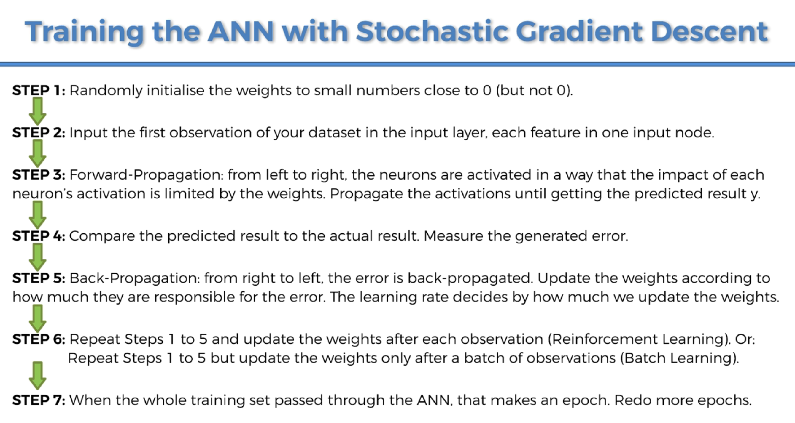
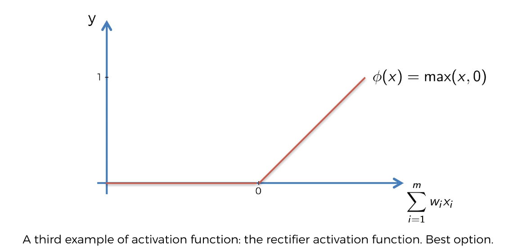
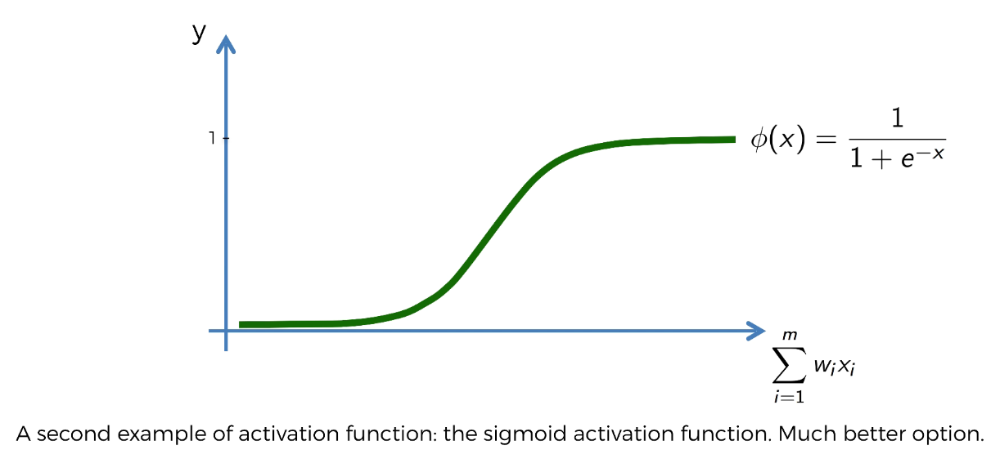
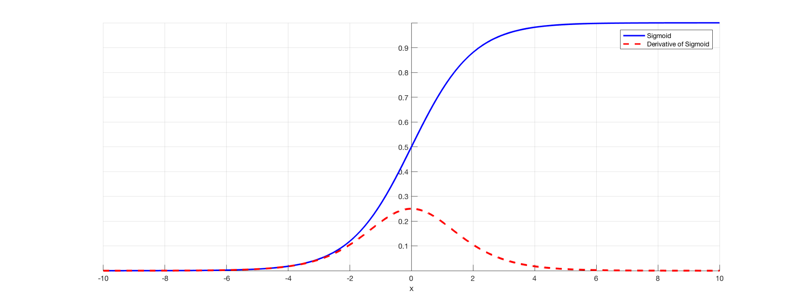
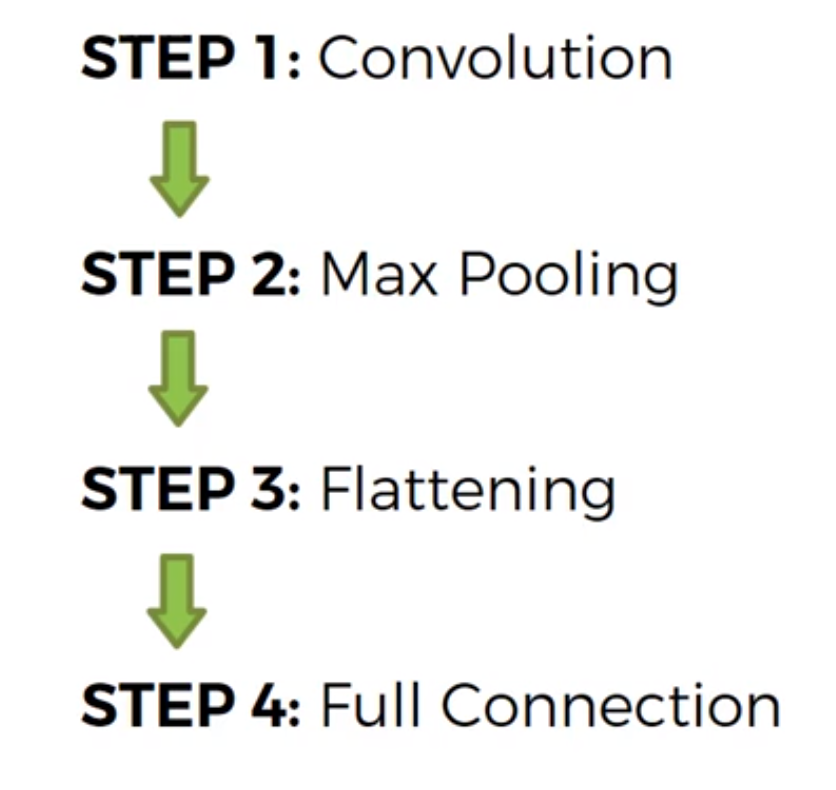
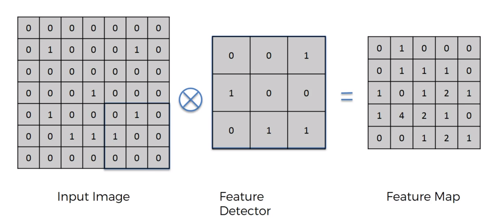
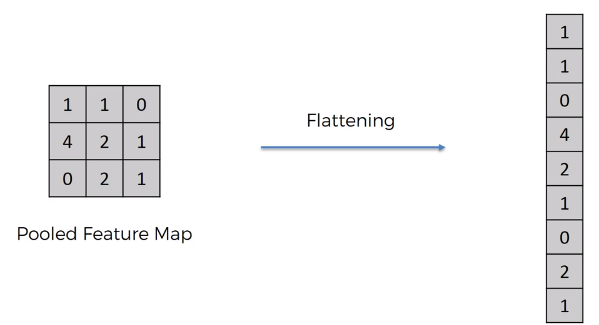
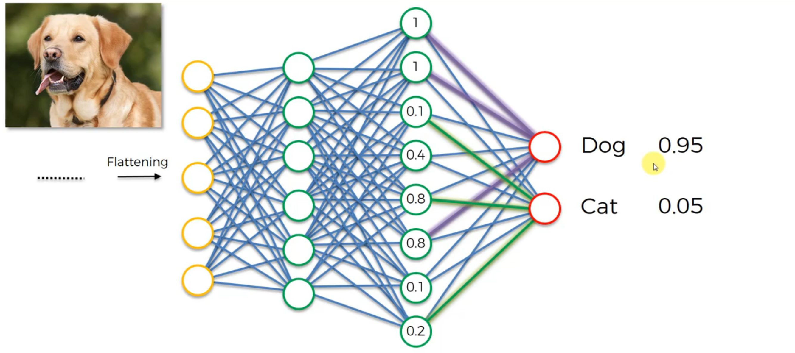
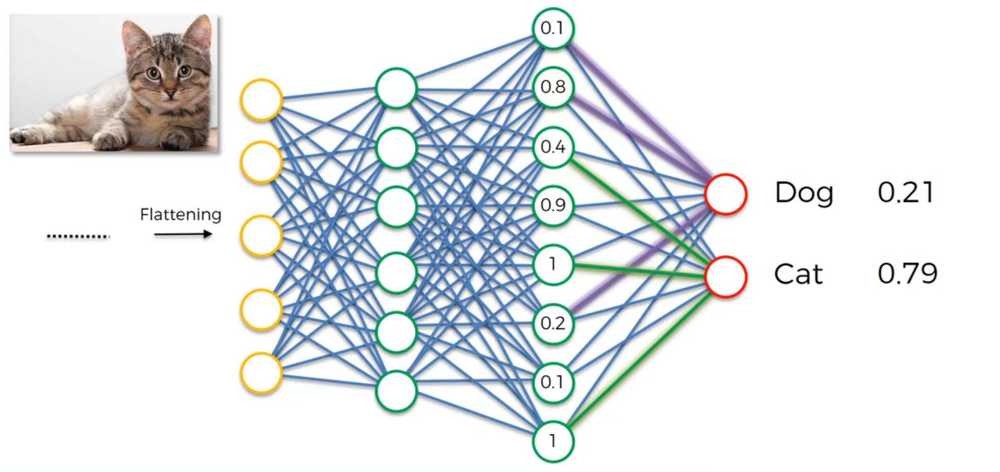
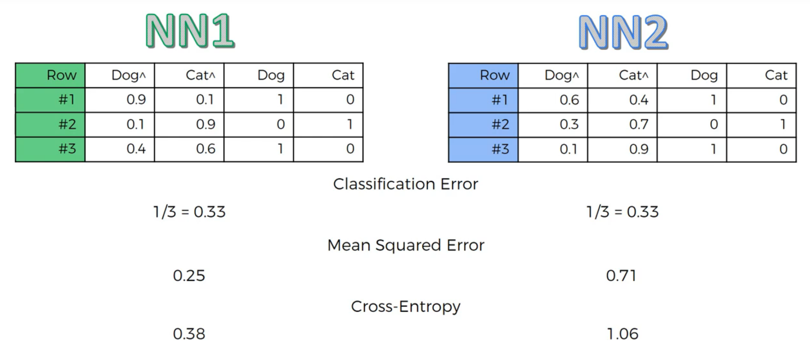

# Standard Scaling

* Standardization of a dataset is a common requirement for many machine learning estimators: they might behave badly if the individual features do not more or less look like standard normally distributed data (e.g. Gaussian with 0 mean and unit variance).

  

* For instance many elements used in the objective function of a learning algorithm (such as the RBF kernel of Support Vector Machines or the L1 and L2 regularizers of linear models) assume that all features are centered around 0 and have variance in the same order. If a feature has a variance that is orders of magnitude larger that others, it might dominate the objective function and make the estimator unable to learn from other features correctly as expected.

  

# Keras and Tensorflow

* Keras as a simplified API to TensorFlow

* Keras is a simple, high-level neural networks library, written in Python that works as a wrapper to Tensorflow[1] or Theano[2] . Its easy to learn and use.Using Keras is like working with Logo blocks. It was built so that people can do quicks POC’s and experiments before launching into full scale build process

* TensorFlow is somewhat faster than Keras

 

[Keras Function Input Explaination](https://stackoverflow.com/questions/44747343/keras-input-explanation-input-shape-units-batch-size-dim-etc)
  

# Encoder

  

  

[Mupltiple encoding techniques Intro: label, one-hot, vector, optimal binning, target encoding](https://maxhalford.github.io/blog/target-encoding-done-the-right-way/)

  

  

[All encoder methods](https://towardsdatascience.com/smarter-ways-to-encode-categorical-data-for-machine-learning-part-1-of-3-6dca2f71b159) !!! IMPORTANT

  

***Summary:***

  

***Classic Encoders***

The first group of five classic encoders can be seen on a continuum of embedding information in one column (Ordinal) up to _k_ columns (OneHot). These are very useful encodings for machine learning practitioners to understand.

  

**_Ordinal_** — convert string labels to integer values 1 through _k_. Ordinal.

**_OneHot_** — one column for each value to compare vs. all other values. Nominal, ordinal.

**_Binary_** — convert each integer to binary digits. Each binary digit gets one column. Some info loss but fewer dimensions. Ordinal.

**_BaseN_** — Ordinal, Binary, or higher encoding. Nominal, ordinal. Doesn’t add much functionality. Probably avoid.

**_Hashing_** — Like OneHot but fewer dimensions, some info loss due to collisions. Nominal, ordinal.

  

 

  

***Contrast Encoders***

The five contrast encoders all have multiple issues that I argue make them *unlikely to be useful for machine learning*. They all output one column for each column value. I would avoid them in most cases. Their [stated intents](http://www.willmcginnis.com/2015/11/29/beyond-one-hot-an-exploration-of-categorical-variables/?source=post_page---------------------------)are below.

  

**_Helmert_** _(reverse)_ — The mean of the dependent variable for a level is compared to the mean of the dependent variable over all previous levels.

**_Sum_** — compares the mean of the dependent variable for a given level to the overall mean of the dependent variable over all the levels.

**_Backward Difference_** — the mean of the dependent variable for a level is compared with the mean of the dependent variable for the prior level.

**_Polynomial_** — orthogonal polynomial contrasts. The coefficients taken on by polynomial coding for k=4 levels are the linear, quadratic, and cubic trends in the categorical variable.

  

 

  

***Bayesian Encoders***

  

The Bayesian encoders use information from the dependent variable in their encodings. They output one column and can work well with high cardinality data.

  

**_Target_** — use the mean of the DV, must take steps to avoid overfitting/ response leakage. Nominal, ordinal. For classification tasks.

**_LeaveOneOut_** — similar to target but avoids contamination. Nominal, ordinal. For classification tasks.

**_WeightOfEvidence_** — added in v1.3. Not documented in the [docs](http://contrib.scikit-learn.org/categorical-encoding/?source=post_page---------------------------) as of April 11, 2019. The method is explained in [this post](https://www.listendata.com/2015/03/weight-of-evidence-woe-and-information.html?source=post_page---------------------------).

**_James-Stein_** — forthcoming in v1.4. Described in the code [here](https://github.com/scikit-learn-contrib/categorical-encoding/blob/master/category_encoders/james_stein.py?source=post_page---------------------------).

**_M-estimator_** — forthcoming in v1.4. Described in the code [here](https://github.com/scikit-learn-contrib/categorical-encoding/blob/master/category_encoders/m_estimate.py?source=post_page---------------------------). Simplified target encoder.

  

 

  

## Label encoding

  

Label encoding is simply converting each value in a column to a number, usually from test to numerical. For example, the `body_style` column contains 5 different values. We could choose to encode it like this:

  

- convertible -> 0

- hardtop -> 1

- hatchback -> 2

- sedan -> 3

- wagon -> 4

  

DISADVANTAGE:

The numeric values can be “misinterpreted” by the algorithms. For example, the value of 0 is obviously less than the value of 4 but does that really correspond to the data set in real life? Does a wagon have “4X” more weight in our calculation than the convertible? I don't think so.

  

## One-hot encoding

  

convert each category value into a new column and assigns a 1 or 0 (True/False) value to the column. This has the **benefit** of not weighting a value improperly but does have the downside of adding more columns to the data set.

  

## Target encoding

[Target encoding]([http://docs.h2o.ai/h2o/latest-stable/h2o-docs/data-munging/target-encoding.html](http://docs.h2o.ai/h2o/latest-stable/h2o-docs/data-munging/target-encoding.html))

  

Target encoding is the process of replacing a categorical value with the mean of the target variable. In this example, we will be trying to predict `bad_loan` using our cleaned lending club data: [https://raw.githubusercontent.com/h2oai/app-consumer-loan/master/data/loan.csv](https://raw.githubusercontent.com/h2oai/app-consumer-loan/master/data/loan.csv).

  

One of the predictors is `addr_state`, a categorical column with 50 unique values. To perform target encoding on `addr_state`, we will calculate the average of `bad_loan` per state (since `bad_loan` is binomial, this will translate to the proportion of records with `bad_loan = 1`).

  

For example, target encoding for `addr_state` could be:

  

|addr_state |average bad_loan|

|-------------|--------------|

|AK |0.1476998|

|AL | 0.2091603|

AR|0.1920290

AZ|0.1740675

CA|0.1780015

CO|0.1433022

  

**Instead of using state as a predictor in our model, we could use the target encoding of state.**

  

  

# Dummy Variables (one-hot encoding): One-hot encoding must apply in classifier

[Use of Dummy Variables](https://www.moresteam.com/WhitePapers/download/dummy-variables.pdf)

  

  

## Why one-hot encoding in classifier, not label encoding?

  

Because the **disadvantage of label encoding:** The numeric values can be “misinterpreted” by the algorithms. For example, the value of 0 is obviously less than the value of 4 but does that really correspond to the data set in real life? Does a wagon have “4X” more weight in our calculation than the convertible? I don't think so.

  

**This has the benefit of not weighting a value improperly but does have the downside of adding more columns to the data set.**

  

## Dummy Variable Trap:

The Dummy variable trap is a scenario where there are attributes which are highly correlated (Multicollinear) and one variable predicts the value of others. When we use one hot encoding for handling the categorical data, then one dummy variable (attribute) can be predicted with the help of other dummy variables. Hence, one dummy variable is highly correlated with other dummy variables. Using all dummy variables for regression models lead to dummy variable trap. **So, the regression models should be designed excluding one dummy variable.** (say, we have three, remove one of them)

  

# ANN training step

  

# Activation Functions:

  

  

### Rectifier (“I want to see only what I am looking for”)

### Sigmoid

### Softmax (Also known as “give-me-the-probability-distribution” function)

#### Example

#### Formula

  

# Keras

### Dense(): Choose number of nodes in the hidden layer

units = avg(# of nodes in the input layer, # of nodes in the output layer)

in which, 11 predictors and 1 response variable => (11+1)/2 => 6

  

### Choose activation function:

[Activation function cheetsheet](https://ml-cheatsheet.readthedocs.io/en/latest/activation_functions.html)

* Both **sigmoid (kill gradients; slow converage (vanishing gradient); ok in the last layer) and tanh functions are not suitable for hidden layers *(and avoid them)*** because if z is very large or very small, the slope of the function becomes very small which slows down the gradient descent which can be visualized in the below video.

* **Rectified linear unit (relu) is a preferred choice for !!*all hidden layers*!!** because its derivative is 1 as long as z is positive and 0 when z is negative. In some cases, **leaky rely can be used just to avoid exact zero derivatives (dead neurons but avoid overfitting).**

* **Softmax:** Use in **output layer** for classification In the case of multiclass specification, the actual class you have predicted will assemble in a value close to 1. And all other classes are assembled in values close to 0

* **Linear:** Use in **output layer** for regression

  

### Loss Functions: ?????????????

Cross-Entropy: Classification the decision boundary in a classification task is large (in comparison with regression)

  

MSE: Regression

  

### Gradient vanishing

Certain activation functions, like the sigmoid function, **squishes a large input space into a small input space between 0 and 1. Therefore, a large change in the input of the sigmoid function will cause a small change in the output.** Hence, the derivative becomes small. For instance, *first layer will map a large input region to a smaller output region, which will be mapped to an even smaller region by the second layer, which will be mapped to an even smaller region by the third layer and so on. As a result, even a large change in the parameters of the first layer doesn't change the output much.*

when n hidden layers use an activation like the sigmoid function, n smalJackie Chi Kit Cheung

l derivatives are multiplied together. Thus, **the gradient decreases exponentially as we propagate down to the initial layers.**

  

### Sigmoid vs Softmax

|Softmax Function| Sigmoid Function|

|-------|----------|

|Used for **multi-classification** logistic regression model|Used for **binary classification** in logistic regression model|

|The probabilities sum will be 1 | The probabilities sum need not be 1|

|Used in the different layers of neural networks| Used as activation function while building neural networks|

|The high value will have the higher probability than other values|The high value will have the high probability but not the higher probability|

  

  

## Overfitting

  

Def: While training the model, you can observe **some high** accuracy and **some low** accuracy so you have **high variance**

  

  

## Dropout Regularization

  

During training, some number of layer outputs are randomly ignored or “_dropped out_.”

  

Question: [Where should I place dropout layers in a neural network?](https://stats.stackexchange.com/questions/240305/where-should-i-place-dropout-layers-in-a-neural-network)

In the original paper that proposed dropout layers, by [Hinton (2012)](https://arxiv.org/pdf/1207.0580.pdf), dropout (with p=0.5) was used on **each of the fully connected (dense) layers** before the output; **it was not used on the convolutional layers**. This became the most commonly used configuration.

  

[More recent research](http://mipal.snu.ac.kr/images/1/16/Dropout_ACCV2016.pdf) has shown some value in applying dropout also to convolutional layers, although at much lower levels: p=0.1 or 0.2. **Dropout was used after the activation function of each convolutional layer: CONV->RELU->DROP.**

  

  

### One-hot encoding in classifier

  

MSE VS CROSS-ENTROPY

  

  

  

### In softmax classifier, why use exp function to do normalization?

[Because we use the natural exponential, we hugely increase the probability of the biggest score and decrease the probability of the lower scores when compared with standard normalization. Hence the "max" in softmax.](https://datascience.stackexchange.com/questions/23159/in-softmax-classifier-why-use-exp-function-to-do-normalization)

  

  

# CNN (Convolutional Neural Networks)

## !!!!!! IMPORTANT TO UNDERSTAND CNN IN WHOLE: Objective of Convolutional layer

[Example of Popular CNN Architectures, refer to *Classic Network* section](https://www.analyticsvidhya.com/blog/2018/12/guide-convolutional-neural-network-cnn/)

Extract features from input image or prior layers

**Conv layer keep the dimension of input image or prior layer data (extract features/generate feature maps or filters), while pooling layer decrease the data dimension exponentially (extract more important feature)**

## Architecture to get high accuracy results from popular networks

 

**Note:** Regarding choose number of pairs of convS-pooling, refer to section *!!!!!! CNN   Architecture for MNIST*; ***Conv layer can be followed by BN as well.*** 

 
 
 
 

**CODE EXAMPLES:**

[Keras Function Input Explaination](https://stackoverflow.com/questions/44747343/keras-input-explanation-input-shape-units-batch-size-dim-etc)

##### Initialising the CNN
classifier = Sequential()

##### Step 1 - Convolution (two covolutional layers) #Conv layer can be followed by BN as well.
input_size = (128, 128)
classifier.add(Conv2D(32, (3, 3), input_shape=(*input_size, 3)))
classifier.add(Activation("relu"))
classifier.add(Conv2D(32, (3, 3), activation = "relu"))

##### Step 2 - Pooling
classifier.add(MaxPooling2D(pool_size=(2, 2)))  # 2x2 is optimal
classifier.add(BatchNormalization())
classifier.add(Dropout(0.2))

##### Adding a second convolutional(two)-pooling pair of layers #Conv layer can be followed by BN as well.
classifier.add(Conv2D(32, (3, 3)))
classifier.add(Activation("relu"))
classifier.add(Conv2D(32, (3, 3), activation = "relu"))
classifier.add(MaxPooling2D(pool_size=(2, 2)))
classifier.add(BatchNormalization())
classifier.add(Dropout(0.2))

##### Adding a third convolutional(three)-pooling pair of layers #Conv layer can be followed by BN as well.
classifier.add(Conv2D(64, (3, 3)))
classifier.add(Activation("relu")) 
classifier.add(Conv2D(64, (3, 3), activation = "relu"))
classifier.add(Conv2D(64, (3, 3), activation = "relu"))
classifier.add(MaxPooling2D(pool_size=(2, 2)))
classifier.add(BatchNormalization())
classifier.add(Dropout(0.2))

##### Step 3 - Flattening
classifier.add(Flatten())

##### Step 4 - Full connection
classifier.add(Dense(units=64, activation='relu'))
classifier.add(Dropout(0.2))
classifier.add(Dense(units=1, activation='sigmoid'))

##### Compiling the CNN
classifier.compile(optimizer='adam', loss='binary_crossentropy', metrics=['accuracy'])

 
 
 
 

Example:

 
 
 
 

  

Input Image -> Feature Detector (Kernel or Filter) = **Feature Map** (how many pixels of Input pixels match Feature Detector matrix) (make the image smaller) (lose information but force on important features to us) (dimentions same as input image or prior layer)

  

  

## Feature Detector/ Filter

Convolutional Neural Networks are (usually) supervised methods for image/object recognition. This means that you need to train the CNN using a set of labelled images: this allows to optimize the weights of its convolutional filters, hence learning the filters shape themselsves, to minimize the error.

  

Once you have decided the size of the filters, as much as the initialization of the filters is important to "guide" the learning, you can indeed initialize them to random values, and let the learning do the work.

  

  

### ReLU Layer, remove negative value of image

  

  

## Max Pooling/ Max Subsampling

  

**Feature Maps** -> Extract the max value in the box (2X2 stride) -> **Pooled Feature Map**

  

1. Preserve the information but get rid of large portion of features, which are not important

2. Redure number of parameter of the finals in neural network

3. Avoid overfitting, disregarding the unnecessary information

  

  

  

## Sub-sampling/ Average pooling

**Feature Maps** -> Extract the average value in the box (2X2 stride) -> **Pooled Feature Map**

  

## Flattening

  

**Pooled Feature Map** -> Flattening, row by row -> long column -> neural nets

Overall Procedure:

## Full Connection

## Softmax & Cross-Entropy

**softmax** 把分类输出标准化成概率分布，**cross-entropy** 刻画预测分类和真实结果之间的相似度。

 Cross-Entropy: cost function for classification, CNN
 MSE: Regression
 Why Cross-Entropy in classification:

When you **derive the cost function** from the aspect of probability and distribution, you can observe that **MSE happens when you assume the error follows Normal Distribution** and **cross-entropy when you assume binomial distribution**. It means that implicitly when you use **MSE, you are doing regression** (estimation) and when you use **CE, you are doing classification**.

Let's say your outcome that you want is one and right now you are at one millionth of one, right?

0.000001.

And then, next time you improve your outcome ***from one millionth to one thousandth** and in terms of, if you calculate the squared error, you're just subtracting one from the other, or basically in each case you're calculating the squared error and you'll see that the **squared error*** is when you compare one case versus the other, it **didn't change that much**. You didn't improve your network that much when you're looking at the mean squared error. But if you're looking at the **cross-entropy, because you're taking a logarithm,** and then you're **comparing the two, dividing one with the other**, you will see that you have actually **improved your network significantly**. So that jump from one millionth to one thousandth in mean squared error terms will be very low. It will be insignificant and it won't guide your gradient boosting process or your back propagation in the right direction. It will guide it in the right direction but it will be like a very slow guidance, it won't have enough power, whereas if you do through **cross-entropy**, cross-entropy will understand that, oh **even though these are very small adjustments that are just, you know, making a tiny change in absolute terms, in relative terms, it's a huge improvement, and we're definitely going in the right direction**, let's keep going that way.

 

### Practical Notes

Use ImageDataGenerator() from Keras when there are not much images. 
*It will create many batches of our images, and in each batch it will apply some random transformations on a random selection of our images, like rotating them, flipping them, shifting them, or even shearing them, and eventually what we'll get during the training is many more diverse images inside these batches, and therefore a lot more material to train.*

Because the transformations are random transformations, well our model will never find the same picture across the batches. So **all this image augmentation trick can only reduce overfitting.**

In summary, ***image augmentation is a technique that allows us to enrich our data set, our data set, without adding more images and therefore that allows us to get good performance results with little or no overfitting, even with a small amount of images.***

### Improve the model
1. Add a convolutional layer (will extract more features, but too many convolutional layers will cause overfitting, ex: [Suppose we train a model for detecting cats. If all cats features are detected and we add more layers, it can start detecting the bell the cat is wearing as a part of the cat. It may end up classifying a cat without bell as not cat and may sometimes classify another animal with bell as cat. This is because adding more layers beyond a certain threshold leads to finding irregularities in the data](https://www.quora.com/Does-adding-more-layers-always-result-in-more-accuracy-in-convolutional-neural-networks)) OR
2. Add a fully connected layer

## !!!!!! CNN 	Architecture for MNIST
[Kaggle Experiment](https://www.kaggle.com/cdeotte/how-to-choose-cnn-architecture-mnist)

1. **How many convolution-pooling pairs? (choose number of convolutional-pooling layers)**
**Pooling will decrease dimensions of your data exponentially. And so even if you have an image of size 256 x 256, you only get maybe 5 pools before you lose too much information (and therefore 5 convolutions) (256/(2^5)=8)**
input image = 28x28, after one pair, it's 14x14. After two, it's 7x7. After three it's 4x4 (or 3x3 if we don't use padding='same'). It doesn't make sense to do a fourth convolution.
TWO if computational cost matters, otherwise 3.
NOTE: Conv2D(): filters number is double in each sequential layer, ex:
**It's typical to increase the number of feature maps for each subsequent pair as shown here.**
nets = 3
model = [0] *nets

for j in range(3): 
    model[j] = Sequential() 
    model[j].add(Conv2D(**24**,kernel_size=5,padding='same',activation='relu',
            input_shape=(28,28,1))) 
    model[j].add(MaxPool2D()) 
    if j>0: 
        model[j].add(Conv2D(**48**,kernel_size=5,padding='same',activation='relu')) 
        model[j].add(MaxPool2D()) 
    if j>1: 
        model[j].add(Conv2D(**64**,kernel_size=5,padding='same',activation='relu')) 
        model[j].add(MaxPool2D(padding='same')) 
    model[j].add(Flatten()) 
    model[j].add(Dense(256, activation='relu')) 
    model[j].add(Dense(10, activation='softmax')) 
    model[j].compile(optimizer="adam", loss="categorical_crossentropy", metrics=["accuracy"])

Another layers number choice example:
if input image is 64x64:
one pair: 32x32
two pair: 16x16
three pair: 8x8
four pair: 4x4 
so the filters number should be increased in each sequential layers. such as 24, 48 64, 128. 
Hence, 3 or 4 layers

2. **How many feature maps?**
It appears that **32 maps in the first convolutional layer** and **64 maps in the second convolutional layer** is the best. Architectures with more maps only perform **slightly better** and are not worth the additonal computation cost.

3. **How large a dense layer?**
It appears that **128 units is the best**. Dense layers with more units only perform **slightly better** and are not worth the additional computational cost. (I also tested **using two consecutive dense layers** instead of one, but that showed **no benefit over a single dense layer**.)

4. **How much dropout?**
From the experiment, **40%(30%-50%)** is the best.

5. **Kernal size**
Instead of using one convolution layer of size 5x5, you can mimic 5x5 by using two consecutive 3x3 layers and it will be more nonlinear.

6. **Stride** (Stride is the number of pixels shifts over the input matrix. When the stride is 1 then we move the filters to 1 pixel at a time. When the stride is 2 then we move the filters to 2 pixels at a time and so on)
Instead of using a max pooling layer, you can pool by using a convolution layer with strides=2 and it will be learnable

7. What is the **benefit of using two consecutive convolutional layers then a pool layer instead of a conv pool**?

**Pooling decreases the dimensions of your data exponentially**. And so even if you have an image of size 256 x 256, you only get maybe 5 pools before you **lose too much information** (and therefore 5 convolutions). As a result, we would typically like to have multiple conv layers before a pool, so that we can build up **better representations of the data without quickly losing all of your spatial information**.

In fact, we often don't even use two convolutions per pool, in many of the modern large image classifican networks, like VGG, Inception and ResNet, you can often see 5–30 conv layers at a time before pooling!

8. **Batch normalization** HELPS!
9. **Data augumentation** HELPS! (ImageDataGenerator() from Keras)

### Batch Normalization
#### Why do we use batch normalization?
**We normalize the input layer by adjusting and scaling the activations**. For example, when we have features from 0 to 1 and some from 1 to 1000, we should normalize them to **speed up learning**. If the input layer is benefiting from it, why not do the same thing also for the values in the hidden layers, that are changing all the time, and get 10 times or more improvement in the training speed.
Batch normalization **reduces the amount by what the hidden unit values shift around (covariance shift)**. To explain covariance shift, let’s have a deep network on cat detection. We train our data on only black cats’ images. So, if we now try to apply this network to data with colored cats, it is obvious; we’re not going to do well. The training set and the prediction set are both cats’ images but they differ a little bit. In other words, if an algorithm learned some X to Y mapping, and if the distribution of X changes, then we might need to retrain the learning algorithm by trying to align the distribution of X with the distribution of Y. 
Also, batch normalization **allows each layer of a network to learn by itself a little bit more independently of other layers.**

#### Why Does Batch Norm Work? 
We can use higher learning rates because batch normalization **makes sure that there’s no activation that’s gone really high or really low.** And by that, things that previously couldn’t get to train, it will start to train.
It **reduces overfitting because it has a slight regularization effects. Similar to Dropout, it adds some noise to each hidden layer’s activations**. Therefore, **if we use batch normalization, we will use less dropout**, which is a good thing because we are not going to lose a lot of information. However, we **should not depend only on batch normalization for regularization**; we should better use it together with dropout.

#### How does batch normalization work?
To increase the stability of a neural network, batch normalization normalizes the output of a previous activation layer by **subtracting the batch mean and dividing by the batch standard deviation.**
However, **after this shift/scale of activation outputs** by some randomly initialized parameters, the **weights in the next layer are no longer optimal**. **SGD ( Stochastic gradient descent) undoes this normalization** if it’s a way for it to minimize the loss function.
Consequently, batch normalization adds two trainable parameters to each layer, so the *normalized output is multiplied by a “standard deviation” parameter (gamma) and add a “mean” parameter (beta).* In other words, *batch normalization lets SGD do the **denormalization** by changing only these two weights for each activation, instead of losing the stability of the network by changing all the weights.*

#### Batch normalization and pre-trained networks like VGG:
VGG doesn’t have a batch norm layer in it because batch normalization didn’t exist before VGG. If we train it with it from the start, the pre-trained weight will benefit from the normalization of the activations. So adding a batch norm layer actually improves ImageNet, which is cool. You can add it to dense layers, and also to convolutional layers.
**If we insert a batch norm in a pre-trained network, it will change the pre-trained weights, because it will subtract the mean and divide by the standard deviation for the activation layers and we don’t want that to happen because we need those pre-trained weights to stay the same. So, what we need to do is to insert a batch norm layer and figure out gamma and beta in order to undo the outputs change.**
To summarize everything, you can think about batch normalization as doing preprocessing at every layer of the network.

### Batch size; Epoch; Iterations 

[Detailed Explainations; Ad](https://stats.stackexchange.com/q/153535)

In short, **The batch size defines the number of samples that will be propagated through the network.**

**Advantages of using a batch size < number of all samples:**

It requires less memory. Since you train the network using fewer samples, the overall training procedure requires less memory. That's especially important if you are not able to fit the whole dataset in your machine's memory.

Typically networks train faster with mini-batches. That's because we update the weights after each propagation. In our example we've propagated 11 batches (10 of them had 100 samples and 1 had 50 samples) and after each of them we've updated our network's parameters. If we used all samples during propagation we would make only 1 update for the network's parameter.

**Disadvantages of using a batch size < number of all samples:**

The smaller the batch the less accurate the estimate of the gradient will be. In the figure below, you can see that the direction of the mini-batch gradient (green color) fluctuates much more in comparison to the direction of the full batch gradient (blue color)

**batch size** = the number of training examples in one forward/backward pass. The higher the batch size, the more memory space you'll need.
**one epoch** = one forward pass and one backward pass of all the training examples

**number of iterations** = number of passes, each pass using [batch size] number of examples. To be clear, one pass = one forward pass + one backward pass (we do not count the forward pass and backward pass as two different passes)..

### Padding
#### Summary:
padding是增加各个边的pixels的数量，目的是保持feature map 不要太小，但也没必要超过原图的大小，所以不可以任意数量；
padding的上限是维持feature map 大小与原图大小一致，具体增加pixel的数量多少，由filter的尺寸和stride大小共同决定；
有一个具体的算法，实现padding, filter size, feature map size之间的相互推导计算。

#### padding 存在的意义在于
为了不丢弃原图信息
为了保持feature map 的大小与原图一致
为了让更深层的layer的input依旧保持有足够大的信息量
为了实现上述目的，且不做多余的事情，padding出来的pixel的值都是0，不存在噪音问题。

# RNN (Recurrent Neural Network) 

### The Vanishing Gradient Problem In RNN

Weights are assigned at the start of the neural network with the random values, which are close to zero, and from there the network trains them up. But, when you start with wrec close to zero and multiply xt, xt-1, xt-2, xt-3, … by this value, your gradient becomes less and less with each multiplication.

#### Why

This arrow means that long-term information has to sequentially travel through all cells before getting to the present processing cell. This means it can be easily corrupted by being multiplied many time by small numbers < 0. This is the cause of vanishing gradients.

#### Problem
**If a change in the parameter's value causes very small change in the network's output - the network just can't learn the parameter effectively, which is a problem.** (the gradients of the network's output with respect to the parameters in the early layers become extremely small)

#### Cause
**Vanishing gradient problem depends on the choice of the activation function.** Many common activation functions (e.g sigmoid or tanh) 'squash' their input into a very small output range in a very non-linear fashion. For example, sigmoid maps the real number line onto a "small" range of [0, 1], especially with the function being very flat on most of the number-line. **As a result, there are large regions of the input space which are mapped to an extremely small range.** In these regions of the input space, **even a large change in the input will produce a small change in the output**- hence the gradient is small.

This becomes much **worse when we stack multiple layers** of such non-linearities on top of each other. For instance, first layer will map a large input region to a smaller output region, which will be mapped to an even smaller region by the second layer, which will be mapped to an even smaller region by the third layer and so on. As a result, **even a large change in the parameters of the first layer doesn't change the output much.**

We can **avoid this problem by using activation functions which don't have this property of 'squashing' the input space into a small region.** A popular choice is Rectified Linear Unit which maps  xx  to  max(0,x)max(0,x).

While backproporgating, the weights are getting smaller as shows above will cause the gradient small, training slow and even model will not be able to trained properly. 

#### Solution
1. Exploding Gradient
	* **Truncated Backpropagation** (step BP after a certain point; that's probably not optimal because then you're not updating all the weights; if you don't stop, then you're just going to have a completely irrelevant network.)
	* **Penalties** (penalize gradient)
	* **Gradient Clipping** (have a maximum limit for the gradient.)
2. Vanishing Gradient
	* **Weight Initialization** (initialize your weights to minimize the potential for vanishing gradient.)
	* **Echo State Networks**
	* **LSTM**

## LSTM (Long Short-Term Memory)

W_rec  = 1

<!--stackedit_data:
eyJoaXN0b3J5IjpbLTE4NzMwNDkwMDksLTE2Mzg0Nzk5NTIsND
U2NjIzNjE1LC0xMjAwNzc4OTM4LDE3OTUzNjIxOTIsODAxOTk4
MTczLDExOTg4MTYxNTIsLTE3MDcwNjcwNjVdfQ==
-->