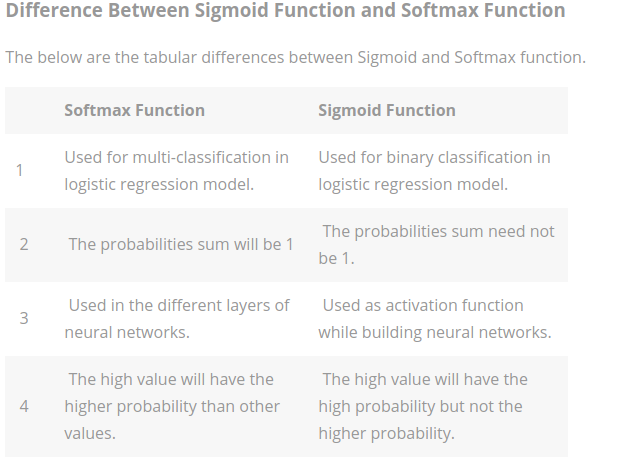

## Standard Scaling 
* Standardization of a dataset is a common requirement for many machine learning estimators: they might behave badly if the individual features do not more or less look like standard normally distributed data (e.g. Gaussian with 0 mean and unit variance).

* For instance many elements used in the objective function of a learning algorithm (such as the RBF kernel of Support Vector Machines or the L1 and L2 regularizers of linear models) assume that all features are centered around 0 and have variance in the same order. If a feature has a variance that is orders of magnitude larger that others, it might dominate the objective function and make the estimator unable to learn from other features correctly as expected.

## Keras and Tensorflow
* Keras as a simplified API to TensorFlow
* Keras is a simple, high-level neural networks library, written in Python that works as a wrapper to Tensorflow[1] or Theano[2] . Its easy to learn and use.Using Keras is like working with Logo blocks. It was built so that people can do quicks POC’s and experiments before launching into full scale build process
* TensorFlow is somewhat faster than Keras

## Dummy Variables (one-hot encoding)
[Use of Dummy Variables](https://www.moresteam.com/WhitePapers/download/dummy-variables.pdf)

### Dummy Variable Trap: 
The Dummy variable trap is a scenario where there are attributes which are highly correlated (Multicollinear) and one variable predicts the value of others. When we use one hot encoding for handling the categorical data, then one dummy variable (attribute) can be predicted with the help of other dummy variables. Hence, one dummy variable is highly correlated with other dummy variables. Using all dummy variables for regression models lead to dummy variable trap. **So, the regression models should be designed excluding one dummy variable.** (say, we have three, remove one of them)

## ANN training step

## Activation Functions:
#### Rectifier

#### Sigmoid

## Keras 
#### Dense(): Choose number of nodes in the hidden layer
units = avg(# of nodes in the input layer, # of nodes in the output layer)
in which, 11 predictors and 1 response variable => (11+1)/2 => 6

#### Choose activation function:
* rectifier for hidden layer
* sigmoid for output layer

#### Sigmoid vs Softmax

