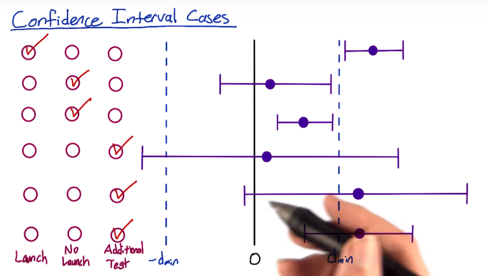

Metrics:
1. Practical significance: magnitude of the difference, which is known as the effect size. Cohen's *d* is the measure of practical significance, 
2. Statistical significance, typically 0.05
3. Binomial distribution
4. Confidence interval, typically 95% 

5. Pooled standard deviriation for two groups of data
6. Sensitivity/recall, true positive rate (correctly identify a patient who has the condition)
7. Statistical power (1-beta), ususally 0.8. know the relationship between power and sample size. (Statistical power is affected chiefly by the size of the effect and the size of the sample used to detect it. Bigger effects are easier to detect than smaller effects, while large samples offer greater test sensitivity than small samples.)
Larger sample size narrow the distribution of test statistics, so power increases as sample size n increases. 

8. Significant level/alpha: alpha increase, power increases.
9. Click-through-probability (unique clicks / unique visits)
10. Estimated difference, d_hat, typically 0.02 (if d_min > 0.02, difference is ok for launch): X_experiment/N_experiment - X_control/N_control
11. Margin of error, m, SE_pool * Z_score(1.96) The larger the margin of error, the less confidence one should have that the poll's reported results are close to the "true" figures; that is, the figures for the whole population
12. Confidence interval, (d_hat - m, d_hat + m). Presentation: if d_hat - m > d_min, it means it is highly likely that the difference of click-through-prob is at least d_min%, say 2%. 
**IF m < statistical significant level AND d_hat - m > d_min, which means they are both significant, then LAUNCH**

